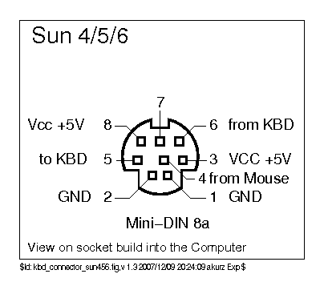

# Type 6 Sun-to-USB Adapter using Arduino Micro Compatible

I am totally a UNIX nerd and one day I decided to get myself an old Sun keybard. Being from Sweden I needed one with a Swedish layout. I was initially looking for a Type 5, but the only one I could find was a Type 6. They do come in a variant with a USB connection, but this one had the old-style proprietary Mini-DIN connection similar to the Type 5.

I didn't want to pass the opportunity up though. Who knows when I would find a Swedish layout Type 5, right? So I bought it and started building myself a Mini-DIN to USB adapter. It is based on the work of [Ben Rockwood][benr] and [Sven Guenther][sven] by forking from the latter. Check those repos out, I owe it all to them.

# Philosophy

I am a software developer with quite a few years of experience within a range of frameworks and platforms, from desktop applications to networking and streaming to web development and large SQL databases. I have even written my fair share of VB for Applications, shrug.

Because of this I wanted to prove to myself that I could accomplish a few key points on this Arduino build:

1. Abstract away from the actual hardware (nuts right?)
2. Structure the project better (I don't like the Arduino Sketchbook thing)
3. Develop in a Test Driven fashion (unit tests first on as much code as possible)

# Structure and Makefile

As a software developer I value both modeling constructs and hierachies. To this end I created a somewhat complex root Makefile, allowing me to include subfolders and source files into my final AVR binary, based on the awesome work from the [Arduino Makefile] project.

# Unit Testing

Of course, I also want to unit test my main logic.

The ```test``` folder contains a bunch of unit tests and a ```Makefile``` that will compile the tests using [GTest and GMock][gtest] on the non-AVR development host. That means that the hardware running the tests is the machine I develop on, not the actual board.

This might of course produce slight deviations, f.x. on an x86 system the size of an ```int``` is probably not 16 bits. However, the tests do give opportunity to make sure the vital logic is in place before even uploading to an Arduino-compatible board.

For this to work a bunch of stubbing needs to be done to remove the dependency on the ```Arduino.h``` and accompanying header files, but with minimal impact on my code. Look to the ```lib``` folder for those headers.

# How Sun Keyboards Work

It's actually gloriously simple, thanks to the cleverness of the original Sun engineers!

The Sun keyboard is actually a 1200 baud serial device.  Seriuosly.  That sounds odd but is actually wonderful because the Arduino can easily interface with it using the [Serial Library](https://www.arduino.cc/en/Reference/Serial).

There is a bug in the original code from both [benr] and [sven] regarding the values received from the keyboard on "key relese".

## Original Interpretation

By using the Arduino Serial Monitor and a simple sketch to listen, we can see what the keyboard is sending.  Press "A" on the keyboard and we get the following (decimal) output to the monitor:

```
77
-51
127
```

After some playing around, you'll realize that the 3 values sent by the keyboard have 3 meanings, representing different actions:

1. **77**: 77 is the code representing the "A" key being pressed down
2. **-51**: This indicates the key being released (key up), but which key?  Add this value to 128 to determine the key!  128-51=77, so the "A" key is being released.  _Clever right!?!_
3. **127**: This code is sent when no other key is being pressed, it is the "all clear" message.

You can verify this all by pressing and holding "A", then pressing and holding "B", then "C", and then release each key one at a time.  You'll clearly see the key downs, key ups, and releases.

## Adjusted Serial Protocol

There is however a nasty little bug hiding on line 37 of the [the original implementation][the nasty bug 1] which taints the above interpretation. As part of the loop that reads from the serial line, in the main code and the [test program source][the nasty bug 2], the following line is used to actually read from the keyboard:

```
char c = sunSerial.read();
```

Looks totally innocent, but notice that the serial read method returns an ```int``` which is stored in a ```char```. On the 8-bit AVR the size of a char is 8 bits, but the size of an ```int``` is 16 bits, thus causing an overflow when assigned to the signed char ```c```. GCC will even throw a ```-Wtype-limits``` warning in the console.

Reading from the official [specification], the example of the 'A' button in the US Scan Set has in fact a "make code" of 0x42 = 77, but the "break code" (what [benr] calls "key release" or "key up") is 0xCD = 205. If you put that in a signed char it will overflow to 205-2^8 = -51.

If we instead use an ```unsigned char```, or perhaps better, an ```int``` the above protocol still basically works. The only adjustment to make is that if the value read on the serial line is > 127 we know that this is a break code. We then _subtract_ 128 to get the corresponding make code of the key released.

## LED Control & Sending Commands to the Keyboard

Commands can be sent on the serial line to the keyboard.  Because they aren't emitted from the keyboard its harder to discover them through trial-and-error. Contained in the official specification however are the pinouts, the scancodes and, most importantly, the serial commands! 

On page 17 of the [specification] you'll find the serial protocol and the commands you can send:

* **0x01**: Reset
* **0x02**: Bell On
* **0x03**: Bell Off
* **0x0A**: Keyboard Click On
* **0x0B**: Keyboard Click Off
* **0x0E**: LED Command
* **0x0F**: Layout Command

The Bell is simply a loud computer speaker sound.  Normally it should only be used in short bursts (like the one your PC makes when it turns on) by sending 0x02, then delay 100ms, then send 0x03 to turn off.  Once turned on it will make a solid tone until you turn it off.

The Keyboard Click is something you may remember from the old WYSE & HP Terminal days.  When enabled you will get a little "chirp" sound every time you press a key.  It brings back nostalgia for about 10 seconds and then is incredibly annoying.

We're not using the Layout command because it seems the scan codes for both PC & UNIX layouts are the same, so currently no need for this.

Reset command is not used right now.

The LED Command is the important one.  You must send 2 bytes, the first is the LED Command 0x0E and the second is a 4-bit bitmask which determines which of the 4 LED's are on or off:

* **0000**: All off
* **0001**: Numlock
* **0010**: Compose
* **0100**: Scroll
* **1000**: Caps Lock

Serial.write() can only pass a single value, so using 2 in sequence is a bit hit or miss. Instead we can create a 2 byte array, the first element is the LED Command 0x0E and the second is the value of the bitmask. Then we can pass that array to Serial.write() as a single unit.

The effect of this is that you must keep the state of the LEDs in your controller, and therefore re-initialize the LEDs on each load in setup() to a known state.

# Modifications to the original source

My version is a bit different, both regarding the fixes to the serial protocol and also in that I want to support a wider range of USB-HID codes. I'm from Sweden and need to have support for the Swedish keyboard layout.

# Visualizing error state

If some error state occurs, I want to be able to blink the onboard LED attached to D13. In order to get a smooth blink I use a timed interrupt in CTC Mode when toggling. My board has a 16Mhz clock, so if I want to blink every 500ms I choose a pre-scaler of 1024 and get a compare match value of ```31249```, which we can only use with the 16-bit timer1. 

I don't want to calculate this choice compare match value and prescaler every time I change my mind on the frequency, so some abstractions around timers and the calculation of settings are nice to have.

# Building the hardware

You will require:

* Board based on the Atmel 32u4 chip, thus being to act as a HID device (I use an Adafruit ItsyBitsy 32u4 5V 16MHz)
* A USB Type A to USB Micro B cable to attach the board to your computer
* A Mini-DIN 8a female connector, the kind built for PCB attachment
* A Sun Mini-DIN variant Type 6 Keyboard, duh!

The Sun keyboard uses a Mini-DIN 8a connector.  Thanks to Alexander Kurz you can find the [Sun Type 4/5/6 Pinout][keyboard pin-outs] on kbdbabel.org:



You'll notice that they keyboard has its own Vcc +5V & Ground as well as a "from keyboard" and "to keyboard".  You also have 3 more wires providing Vcc +5V & Ground plus a single read line for the mouse! We'll ignore the mouse for now.

Lets connect to our board! I use the following pin mapping:  

| Mini-DIN       | Itsybitsy 32u4  |
|----------------|-----------------|
| Pin 2          | GND             |
| Pin 8          | +5V             |
| Pin 6          | D10 (Serial RX) |
| Pin 5          | D11 (Serial TX) |

I bought my DIN connector from the swedish store [Electrokit](https://www.electrokit.com/). I was unsure of the pinout on the mounting end of the connector, so I put my multimeter in diode mode and came up with the following pinout:


I also want to have a configurable key tone, via the keyboard click on and off commands we can send. I add a DIP-switch between the 3V and pin 8, and use a 10k&#8486; resistor to pull pin 8 low when the switch is open. Whenever pin 8 is high we can turn the click on and if it's low we turn it off. Super quick sketch in [Fritzing] of the complete circuit:


The pull-down resistor is actually connected to a ground pin G physically located in the ItsyBitsy between EN and D8, however in the [parts library][Fritzing parts] from Adafruit the ItsyBitsy part only includes one ground pin, GND.

The other channel of the 2-channel DIP-switch is similarly connected between 3V and pin 7, with a 10k&#8486; resistor pulling pin 7 down to ground. Don't know what to do with this yet, but I'll wire it up for future proofing (soldering is fun).

Wire it up and, assuming the pins on your board matches my setup, just do

```
cd src/ && make && make upload
```

from the project root.

# What doesn't work (yet)

< Scope not yet determined >

# Thanks to

* Ben Rockwood for [the original project]
* Sven Guenther for [introducing the HID-Project and complex actions][the later project]
* Alexander Kurz for the [keyboard pin-outs]
* Adafruit for the [itsybitsy 32u4], an awesome board
* [Arduino.cc](https://www.arduino.cc/) for, you know, everything

<!--- references -->
[benr]: https://github.com/benr
[the original project]: https://github.com/benr/SunType5_ArduinoAdapter
[the nasty bug 1]: https://github.com/benr/SunType5_ArduinoAdapter/blob/ce8563530b73615de718b7d3bd865f4cd5b1e1c2/SunKeyboard-to-USB/SunKeyboard-to-USB.ino
[the nasty bug 2]: https://github.com/benr/SunType5_ArduinoAdapter/blob/20bdba3d11223bc0ef12191bc31469b4e79e1b7a/SunKeyboard-Test/SunKeyboard-Test.ino

[sven]: https://github.com/0x6e3078
[the later project]: https://github.com/0x6e3078/SunType5_ArduinoAdapter

[specification]: http://sparc.org/wp-content/uploads/2014/01/KBD.pdf.gz
[keyboard pin-outs]: http://www.kbdbabel.org/conn/index.html

[itsybitsy 32u4]: https://www.adafruit.com/product/3677

[gtest]: https://github.com/google/googletest

[Fritzing]: http://fritzing.org/home/
[Fritzing parts]: https://github.com/adafruit/Fritzing-Library

[arduino makefile]: https://github.com/sudar/Arduino-Makefile
